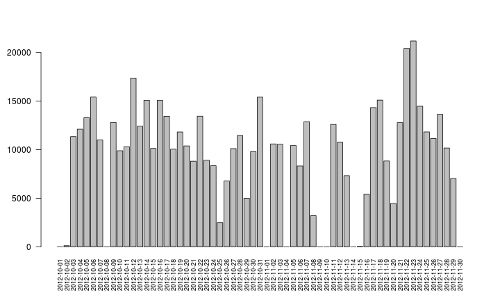
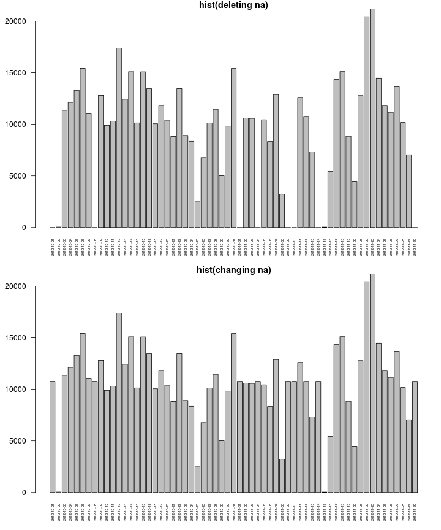

Reproducible Research: Assignment 1
========================================================
# 1. Loading and preprocessing the data
## 1.1 Load the data (i.e. read.csv())

```r
unzip("activity.zip")
data <- read.csv("activity.csv")
```

## 1.2 Process/transform the data (if necessary) into a format suitable for your analysis

```r
dataV = data[!is.na(data$steps), ]
str(data)
```


# 2. What is mean total number of steps taken per day?
## 2.1 Make a histogram of the total number of steps taken each day

```r
days = levels(dataV$date)
totalSteps = c()
for (day in days) {
    totalSteps = c(totalSteps, sum(dataV[dataV$date == day, "steps"]))
}
names(totalSteps) = days
barplot(totalSteps, las = 2, cex.names = 0.75)
```

 


## 2.2 Calculate and report the mean and median total number of steps taken per day

```r
meanSteps = mean(totalSteps)
medianSteps = median(totalSteps)
```


The mean is 9354.2295 and the median is 10395

# 3. What is the average daily activity pattern?
## 3.1 Make a time series plot (i.e. type = "l") of the 5-minute interval (x-axis) and the average number of steps taken, averaged across all days (y-axis)

```r
intervalF = factor(dataV$interval)
means = c()
for (i in levels(intervalF)) {
    means = c(means, mean(dataV[dataV$interval == as.numeric(i), "steps"]))
}
plot(levels(intervalF), means, type = "l")
```

 

## 3.2 Which 5-minute interval, on average across all the days in the dataset, contains the maximum number of steps?

```r
maxInterval = levels(intervalF)[means == max(means)]
```

The 5-minutes interval with the maximum number of steps is 835

# 4. Imputing missing values
## 4.1 Calculate and report the total number of missing values in the dataset (i.e. the total number of rows with NAs)

```r
flags = is.na(data$steps)
rowsWithNA = sum(flags)
```

The number of missing values is 2304
## 4.2 Devise a strategy for filling in all of the missing values in the dataset. The strategy does not need to be sophisticated. For example, you could use the mean/median for that day, or the mean for that 5-minute interval, etc.  
I am going to use the mean in the same interval in the whole data
## 4.3 Create a new dataset that is equal to the original dataset but with the missing data filled in.

```r
data2 = data
index = 0
# for each values ...
for (flag in flags) {
    # print(flag) Calculate index
    index = index + 1
    # index=9158 Is it na?
    if (flag) {
        # Yes! Replace na value
        data2[index, "steps"] = mean(dataV[dataV$interval == data2[index, "interval"], 
            "steps"])
    }
}
```

## 4.4 Make a histogram of the total number of steps taken each day and Calculate and report the mean and median total number of steps taken per day. Do these values differ from the estimates from the first part of the assignment? What is the impact of imputing missing data on the estimates of the total daily number of steps?

```r
days2 = levels(data2$date)
totalSteps2 = c()
for (day2 in days2) {
    totalSteps2 = c(totalSteps2, sum(data2[data2$date == day2, "steps"]))
}
names(totalSteps2) = days2
par(mfrow = c(2, 1), mar = c(4, 4, 1, 1))
barplot(totalSteps, las = 2, cex.names = 0.5, main = "hist(deleting na)")
barplot(totalSteps2, las = 2, cex.names = 0.5, main = "hist(changing na)")
```

 


```r
meanSteps2 = mean(totalSteps2)
print(paste("mean(deleting na): ", meanSteps, ", mean(changing na):", meanSteps2, 
    sep = ""))
```

```
## [1] "mean(deleting na): 9354.22950819672, mean(changing na):10766.1886792453"
```

```r
medianSteps2 = median(totalSteps2)
print(paste("median(deleting na): ", medianSteps, ", median(changing na):", 
    medianSteps2, sep = ""))
```

```
## [1] "median(deleting na): 10395, median(changing na):10766.1886792453"
```


# 5. Are there differences in activity patterns between weekdays and weekends?
## 5.1 Create a new factor variable in the dataset with two levels -- "weekday" and "weekend" indicating whether a given date is a weekday or weekend day.

```r
isweekend = function(x) {
    wday = as.POSIXlt(x)$wday + 1
    (wday == 1 | wday == 7)
}
data2$type = as.factor(sapply(data2$date, isweekend))
levels(data2$type) = c("weekday", "weekend")
```

## 5.2 Make a panel plot containing a time series plot (i.e. type = "l") of the 5-minute interval (x-axis) and the average number of steps taken, averaged across all weekday days or weekend days (y-axis). The plot should look something like the following, which was creating using simulated data:

```r
means2Labor = c()
means2WeekEnd = c()
for (i in levels(intervalF)) {
    means2Labor = c(means2Labor, mean(data2[data2$interval == as.numeric(i) & 
        data2$type == "weekday", "steps"]))
    means2WeekEnd = c(means2WeekEnd, mean(data2[data2$interval == as.numeric(i) & 
        data2$type == "weekend", "steps"]))
}
par(mfrow = c(2, 1), mar = c(4, 4, 1, 1))
plot(levels(intervalF), means2Labor, type = "l", main = "weekday", xlab = "")
plot(levels(intervalF), means2WeekEnd, type = "l", main = "weekend", xlab = "Interval")
```

 

